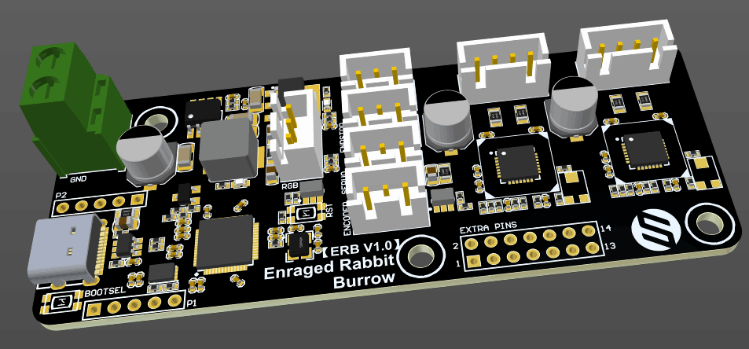
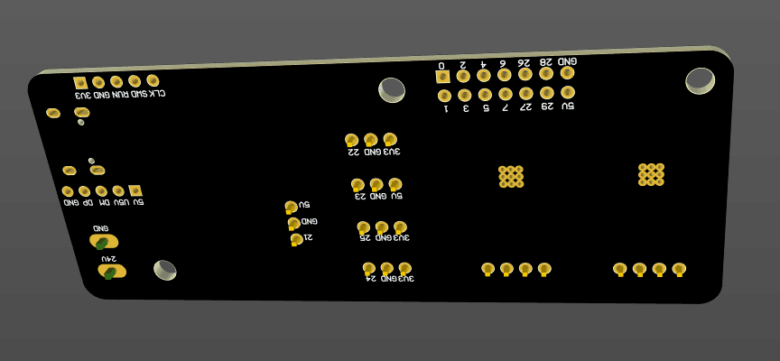
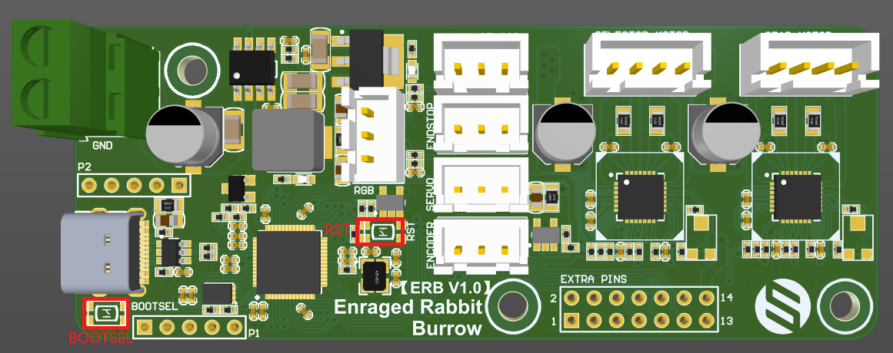

# FYSETC-ERB

This is dedicated controller board for VORON ERCF

## Features

1. Base on popular RP2040 chip, cheep,available

2. Power management chip, comparing to LDO chip, less heat, more powerful, more steady

3. USB type-C interface and more extra pins out.

## Hardware

There are schemetic, silk and dwg file in `Hardware` folder.

## Firmware

### Compile options

### Firmware upload

Step 1: Power on the board

Step 2: Connect ERB to your computer with USBC cable

Step 3: Push an hold `BOOTSEL` button

Step 4: Click `RST` button and release `BOOTSEL` button

Step 5: `RPI-RP2` folder will show up on your computer, copy your built firmware `klipper.uf2` to the folder.

### Configuration

See `ercf_hardware.cfg` in this repository `config` folder.

### Known issues

The mark of GPIO24 and GPIO25 is swapped, check the silk file [here](https://github.com/FYSETC/FYSETC-ERB/blob/main/hardware/Silk%20Fixed.pdf).
