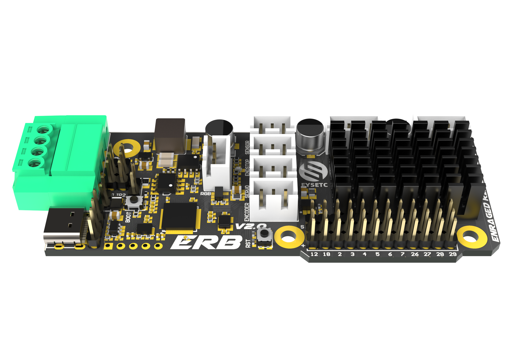
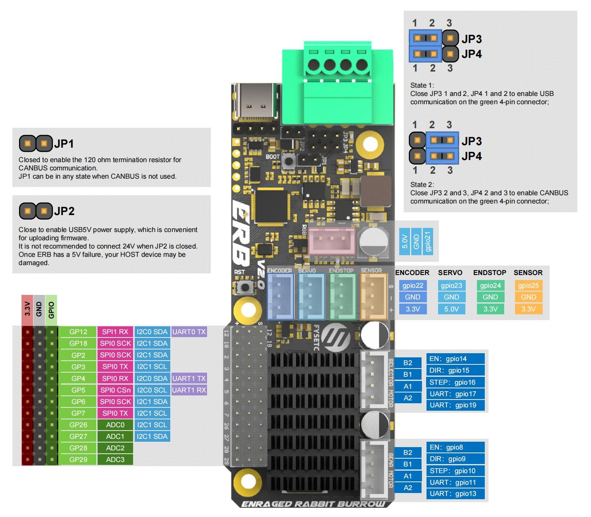
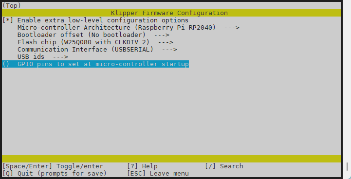
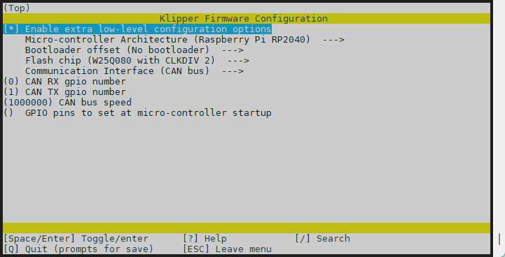
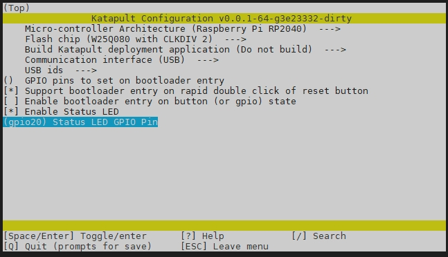
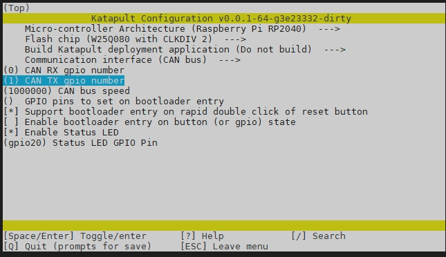
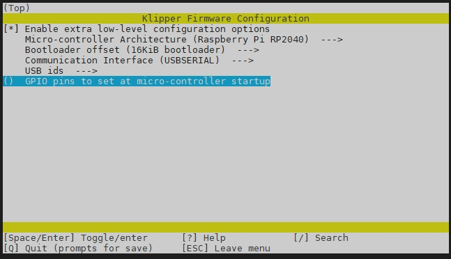
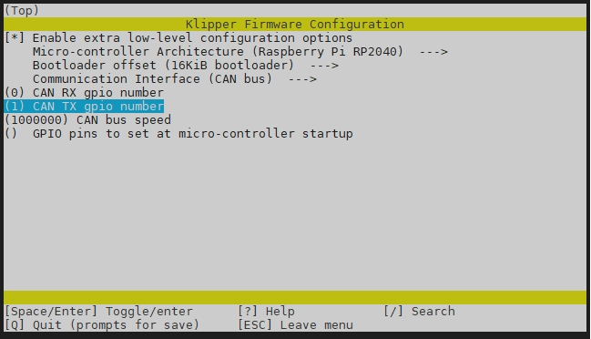

# Introduction

ERB V2 is a 3D printer multi-color control board based on RP2040, mainly used in Enraged Rabbit project. Based on V1, CANBUS connection is added, and the terminal connection method and layout are readjusted to better meet the needs of Enraged Rabbit V2.

## Features

- MCU RP2040 
- 28V Input Max，5V@3A
- USB & CANBUS interface
- 2 x TMC2209 Onboard
- 12 x IO for gate sensors/switch
- Onboard integrated heat sink
- 5V RGB，Servo supported
- Power supply/CAN integrated interface for easy connection

## Hardware

There are schemetic, silk and dwg file in `Hardware` folder.

### Pinout


## Firmware

### Compile and upload
In order to compile and upload at one time, you need to follow the steps below to put RP2040 into dfu mode.

1. Step 1: Connect 24V (Power on the board)
2. Step 2: Connect USB-C cable to your Klipper device (usually Raspberry Pi)
3. Step 3: Push and hold the BOOTSEL button
4. Step 4: Push the RST button and hold 0.5 seconds
5. Step 5: Release the RST button, after 3 seconds, Release the bootsel button
6. Verify your device is in boot mode connected by running the following command:

```shell
lsusb
```

The output should contain an entry looking like 2e8a:0003 Raspberry Pi RP2 Boot


On your klipper device (usually Raspberry Pi) run the following to create your make configuration:

```shell
cd  ~/klipper
make clean
make menuconfig
```

Select the following menuconfig settings

Use USB communication



Use CANBUS communication



And create and upload the firmware files by running the following:

```shell
make flash FLASH_DEVICE=2e8a:0003
```
The output looks like the following - IF you are prompted (you might or might not) for a password, enter the password of your current user account.


Now restart your fystec-erb by disconnecting 24V - waiting some seconds and reconnecting 24V again.
Or press the reset button for one second and then release it.
You should be able to see it as usual klipper device within 
```shell
ls /dev/serial/by-id
```
### Configuration

See `ercf_hardware.cfg` in this repository `config` folder.

---------------------------------------------------

> [!TIP]
> We recommend using the katakulpt bootloader, whether you use USB or CANBUS communication. This can avoid many strange problems.
> 
> Configuration of the katakulpt bootloader:
> 
> 
> 
> 
> Configuration of klipper using katakulpt:
> 
> 
> 


